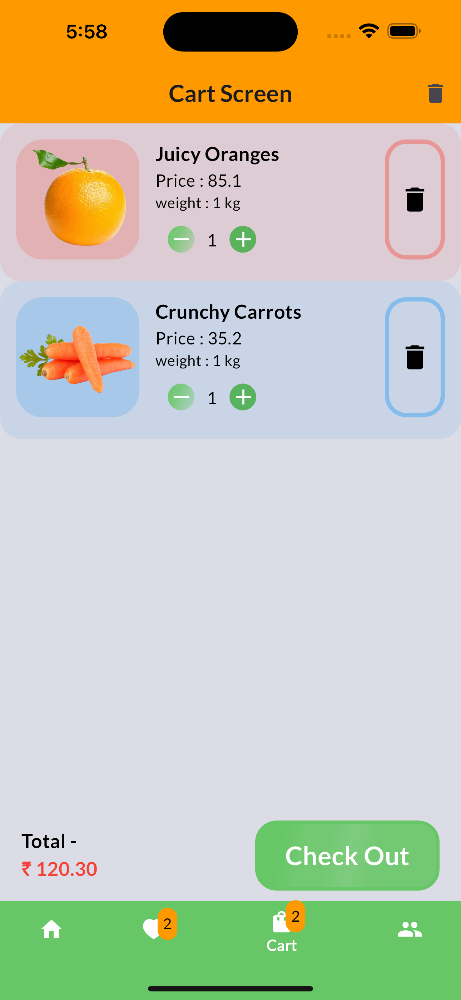

# GrocyCart App by Vivek Raghav

<div style="display: flex; flex-wrap: wrap;">
    
    
    
    
    
<!--      -->
    
    
    
</div> <!-- Add a screenshot or GIF of your app -->

## Overview

The **Grocery App** is a Flutter-based mobile application designed to simplify grocery shopping. It allows users to browse, search, and purchase grocery items conveniently.

## App Functionality based on
  - Flutter 3.19.0.
  - Dart 3.3.0
  - Riverpod (State Management)
  - Firebase Messaging
  - Firebase Storage
  - Firebase Authentication
  - Firebase Database

## Features

1. **User Authentication**:
    - Sign up, log in, and manage user accounts securely.
    - deafult username (vivek@user.com , password - 12345678 or 1234567890)
2. **Product Listings**:
    - fetching the list of products from firebase and make the UI Impressive.
    - Product uploaded on firebase are easy to
    - add product in wishlist or cartlist
    - get the total amount of the price of all the products available in your car list
    - remove all the products at once
3. **Search and Filters**:
    - Search for specific products by name or category.
    - Apply filters.
4. **Cart Management**:
    - Add items to the cart.
    - Adjust quantities and remove items.
    - Proceed to checkout.
5. **Wishlist Management**:
    - Add items to the wishlist.
    - Adjust quantities and remove items.
    - Proceed to add items needed.
5. **Order History**:
    - View past orders and their details.
5. **User Profile**:
    - Manage your name.
    - Manage your username
    - Mange your address
5. **Theme Management**:
    - White and Dark Theme available.
6. **Notifications**:
    - Receive notifications about promotions, order status, and special offers.


## Installation

1. Clone the repository:
   ```
   git clone https://github.com/Vivek-Raghav/Grocery-app.git
   ```

2. Add Android or IOS Platform :
   ```
   flutter add .
   ```

2. Add Firebase in your project :
   ```
   https://firebase.google.com/docs/flutter/setup?platform=ios
   ```

3. Install dependencies:
   ```
   flutter pub get
   ```

4. Run the app:
   ```
   flutter run
   ```

## Contributing

Contributions are welcome! If you'd like to improve the app or add new features, follow these steps:

1. Fork the repository.
2. Create a new branch for your feature.
3. Make your changes.
4. Submit a pull request.

## License

This project is licensed under the Vivek Raghav.
You are not allowed to sell or making money with it 

---

Feel free to replace the placeholder text with actual content, and don't forget to add a screenshot or GIF showcasing your app! Good luck with your project, and happy coding! 🚀🛒
